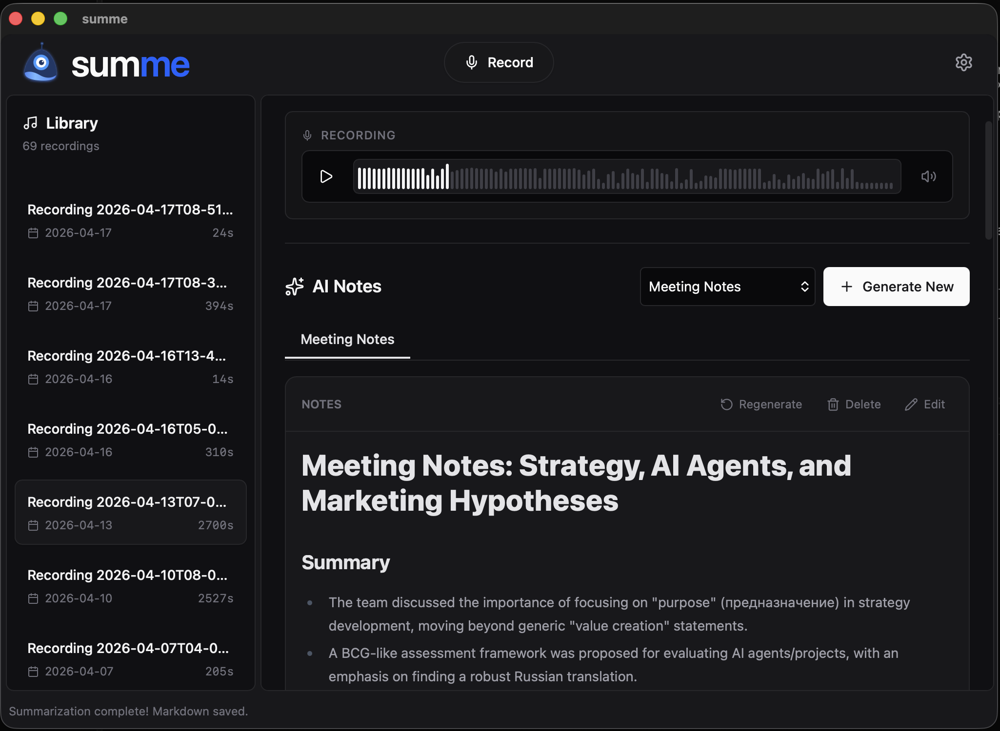

# summe

**Record any conversation. Get the notes. Keep the data.**

summe is a private, local-first desktop app that captures **system audio + microphone** at the same time and turns them into structured **Markdown notes** with **Google Gemini**. No bots in your calls. No uploads to a third-party SaaS. Just a recording on your disk and a transcript next to it.



> **Status**: MVP complete. Native Rust audio engine, real-time AEC, MP3 output, system tray, global hotkeys, multi-segment recording with incremental Gemini summarization, Markdown editor.

---

## Why summe

Most "AI meeting note" tools work the same way: they join your call as a bot, pipe everything through their cloud, charge per seat, and silently store every word you say.

summe inverts that.

- **No bot joins the call.** It records your machine's audio output and your mic locally — the way QuickTime or OBS would, but with one-click summaries on top.
- **Files live on your disk.** Audio, metadata, and generated notes are written into a folder you choose. Move it to iCloud, sync it to Obsidian, drop it in a vault — your data, your filesystem.
- **Only Gemini sees the audio, and only when you ask.** Summarization is opt-in per recording, and uses **your own Gemini API key**.
- **Works for any conversation, not just Zoom.** Lectures, podcasts, in-person interviews, voice memos to yourself, YouTube videos you want a transcript of — anything that makes sound on your laptop.

If you've been pasting `.m4a` files into ChatGPT and prompting "summarize this", summe is the workflow you actually wanted.

---

## Features

### Recording

- **Dual-channel native capture.** Microphone via `cpal`, system output via `qruhear` (ScreenCaptureKit on macOS, native loopback on Windows/Linux). No virtual cables, no DAW setup.
- **Built-in echo cancellation.** Real-time WebRTC AEC + noise suppression keeps system playback out of your mic track, so your voice stays clean even on speaker.
- **Speech-optimized encoding.** 48 kHz capture, MP3 at 64 kbps — small files, intelligible audio, no transcoding step before sending to Gemini.
- **Separate or merged tracks.** Keep mic and system audio as independent files for editing, or write a single merged MP3 — your choice in Settings.
- **Multi-segment sessions.** Pause for a coffee, hit record again — parts are appended to the same recording with their own players in the UI.

### Summarization

- **One click, structured Markdown.** Press *Summarize*, get a heading, key points, action items, and full transcript — formatted for the template you picked.
- **Prompt templates that actually fit the situation.** Ship-ready presets for `meeting_notes`, `lecture_notes`, `brainstorming`, and `interview`. Write your own from the UI; they persist in settings.
- **Re-runnable.** Generated notes are stored as separate `.md` files per template run, so you can compare a "meeting summary" and an "action items only" pass on the same audio without losing either.
- **Incremental for long recordings.** Multi-part sessions are summarized segment-by-segment, with each part receiving the previous part's summary as context — no lost details across breaks.
- **Live progress.** The status bar shows the current stage (upload → processing → generating → writing) and the part index for multi-segment runs, so a 2-hour recording doesn't feel like a black box.

### Workflow

- **Lives in your tray.** Close the window, the app keeps running. The tray icon shows recording state and exposes start/stop without focus-stealing.
- **Global hotkey.** `Cmd+Shift+R` / `Ctrl+Shift+R` toggles recording from anywhere — meeting, browser, full-screen presentation. Customizable in Settings with visual capture.
- **Markdown editor and player, side by side.** Read, edit, and export notes against the audio without leaving the app.
- **Obsidian-friendly layout.** Each recording is a folder with audio + JSON metadata + Markdown — drop the whole storage directory into a vault and it just works.

### Privacy

- **Local-first by default.** Audio, metadata, and summaries never leave your machine unless you press *Summarize*.
- **Bring your own API key.** Gemini calls are made directly from the Rust backend with your key — no proxy, no relay, no telemetry.
- **No accounts, no signup.** Install, point at a folder, paste a key, record.

---

## How it works

1. **Set up once.** Install the app, pick a storage folder, paste a Gemini API key, optionally rebind the hotkey.
2. **Record.** Hit the hotkey or click *Record*. The window can close — the tray keeps the session alive.
3. **Stop.** Audio is encoded to MP3 in the background and saved into a fresh recording folder along with metadata.
4. **Summarize.** Pick a template (or one of your custom prompts) and press the button. Gemini returns a structured Markdown summary with the full transcript inline.
5. **Edit and export.** Tweak the notes in the built-in editor, copy them out, or open the folder directly in Obsidian / Finder / Explorer.

---

## Use cases

- **Freelancers and consultants** — turn every client call into a billable record of decisions and action items.
- **Students and researchers** — capture lectures, interviews, and field recordings; get a searchable transcript without paying per minute.
- **Journalists and podcasters** — record long-form conversations with clean separated tracks for post.
- **Engineers and PMs** — async meeting notes that don't require inviting a SaaS bot to a Zoom that talks about secrets.
- **Privacy-conscious users** — anyone who doesn't want a third party storing every word of every meeting they attend.

---

## Tech stack

- **Shell**: Tauri 2.x — single binary, ~20 MB bundle, no Electron.
- **Frontend**: React 19 + TypeScript + Vite + Tailwind CSS v4 + Radix UI primitives.
- **Audio (Rust)**:
  - `cpal` — microphone capture
  - `qruhear` — native system-audio loopback (ScreenCaptureKit on macOS, WASAPI/PipeWire elsewhere)
  - `webrtc-audio-processing` — real-time AEC, noise suppression, AGC
  - `ringbuf` — lock-free buffering between capture and encoder
  - `mp3lame-encoder` — speech-tuned MP3 output
  - `rubato` — high-quality sinc resampling
- **AI**: Google Gemini REST API via Rust `reqwest` (rustls-tls, no native TLS dependency).
- **OS integration**: native tray menu, `tauri-plugin-global-shortcut`, file-system access.
- **Storage**: plain files. JSON metadata, MP3 audio, Markdown notes — all in a folder you control.

---

## Getting started

The desktop app lives in `apps/desktop/`.

### Prerequisites

- Node.js (LTS)
- Rust toolchain (`rustup`, stable channel)
- A **Gemini API key** ([aistudio.google.com](https://aistudio.google.com/app/apikey) — free tier works)
- Linux only: `libmp3lame` development headers (`apt install libmp3lame-dev` or distro equivalent). On macOS and Windows the encoder is bundled.

### Run in development

```bash
cd apps/desktop
npm install
npm run tauri dev
```

This starts the Vite dev server and the Rust backend, with hot reload on the frontend.

### Build a release binary

```bash
cd apps/desktop
npm run tauri build
```

Output binaries land in `apps/desktop/src-tauri/target/release/bundle/`.

### First-run setup

1. Open the app and click the settings icon.
2. Paste your Gemini API key.
3. Pick a storage directory (this is where every recording lives).
4. Optionally: pick a default microphone, change the hotkey, switch between *merged* and *separated* track modes.

---

## Data layout

Everything is on disk, in plain formats:

```
<storage_dir>/recordings/<id>/
  mic.mp3              # microphone track
  system.mp3           # system-audio track (separated mode)
  merged.mp3           # mixed track (merged mode)
  recording.json       # metadata: parts, durations, settings
  notes_<uuid>.md      # generated Markdown — one per template run
```

Settings and the API key are stored in `settings.json` inside Tauri's `app_data_dir`. Logs go to `app_data_dir/logs/summerizer.log`.

---

## Roadmap

- **Now (MVP)** — recording, AEC, multi-segment, tray, hotkeys, Gemini summaries, Markdown editor, custom prompts.
- **1.0** — quality presets, language selection, polished templates UI, export to Notion / PDF, theming, completion notifications.
- **Post-1.0** — full-text and semantic search across all notes, tags and projects, optional cloud sync, calendar-driven auto-record, team workspaces, mobile (Tauri Mobile).

See [`docs/prd.md`](./docs/prd.md) for the full product brief and [`docs/changelog.md`](./docs/changelog.md) for what shipped recently.

---

## Documentation

- [`docs/prd.md`](./docs/prd.md) — product requirements and target audience
- [`docs/project.md`](./docs/project.md) — architecture, data model, decisions
- [`docs/changelog.md`](./docs/changelog.md) — release-by-release changes

---

## License

summe is licensed under the **Business Source License 1.1** (BSL 1.1). See [LICENSE](./LICENSE.md) for the full text.

- Personal, educational, research, and other non-commercial use is permitted.
- Commercial use (SaaS hosting, paid distribution, internal use at scale) requires a separate license — contact the maintainer.
- On **2029-01-25**, the license automatically converts to **Apache 2.0**.
