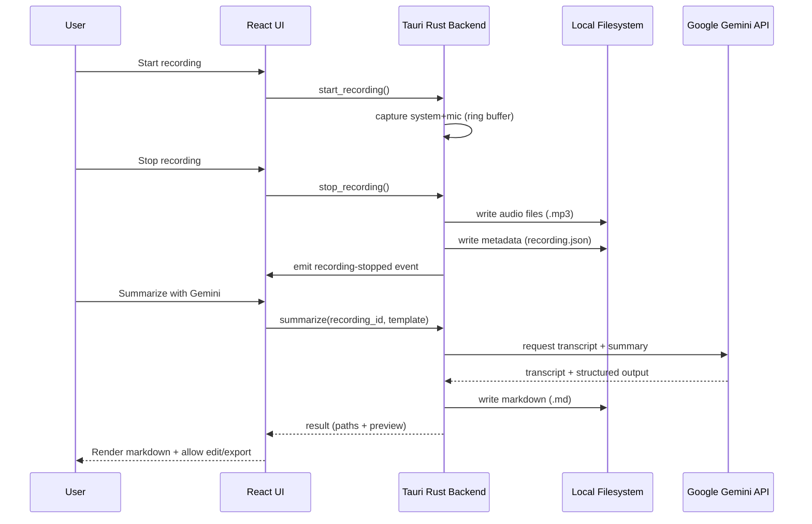

# summe — Project Documentation

## Purpose

summe is a lightweight, privacy-oriented, cross-platform desktop application that records **system audio + microphone** and produces **transcripts and structured summaries** using **Google Gemini**, exporting results into clean **Markdown** files.

## Goals

- Record system audio and microphone simultaneously with reliable A/V timing.
- Provide a minimal, fast UX: record → stop → summarize → preview/edit → export.
- Keep user data local by default (audio, metadata, generated markdown).
- Work in background: tray icon, global shortcuts, close-to-tray.
- Make summarization reproducible and configurable via prompt templates.
- Require a user-provided **Gemini API key** for summarization (no key → summarization disabled).

## Non-goals (MVP)

- Multi-user collaboration and shared workspaces.
- Cloud storage / syncing (optional post-1.0).
- Full semantic search across all notes (post-1.0).
- Calendar integrations (post-1.0).

## Target Tech Stack

- **Desktop framework**: Tauri 2.x
- **Frontend**: React 19 + TypeScript + Vite
- **UI**: shadcn/ui + Radix UI + Tailwind CSS
- **Markdown rendering**: `react-markdown` + `remark-gfm` + `rehype-highlight`
- **Audio capture (Rust)**:
  - Microphone: `cpal`
  - System output (native): `qruhear` (uses `screencapturekit` on macOS, `cpal` on Windows/Linux)
  - Buffering: `ringbuf`
  - Processing: `webrtc-audio-processing` 0.5.0 (AEC, Noise Suppression, AGC)
  - Encoding: `mp3lame-encoder` (MP3)
- **Gemini integration**: Rust (`reqwest`) via REST API
- **Local storage**: filesystem + JSON metadata, `settings.json` for configuration
- **Hotkeys**: `tauri-plugin-global-shortcut`
- **Tray**: Tauri native tray menu

## Repository layout (current)

Implementation lives under `apps/desktop`:

```text
.
├─ apps/
│  └─ desktop/                 # Tauri app (Rust + React)
│     ├─ src/                  # React UI
│     │  ├─ components/        # React components
│     │  │  └─ ui/             # Radix UI + Tailwind primitives (Button, Dialog, etc.)
│     │  └─ ...
│     └─ src-tauri/            # Rust backend
├─ packages/
│  └─ prompts/                 # Prompt templates and versions
└─ docs/
   ├─ prd.md
   ├─ project.md
   └─ changelog.md
```

## Architecture overview

summe uses a **Tauri** application shell:

- **Frontend (React)**: UI, player, list of recordings, markdown preview/editor, settings.
- **Backend (Rust)**: audio capture, encoding, filesystem operations, OS integrations (tray, shortcuts), Gemini requests (option A) or secure IPC bridge (option B).

### High-level components

- **Recording Engine (Rust)**: captures system output + microphone, performs real-time mixing (AEC + AGC), and handles post-recording cleanup/renaming based on the selected mode.
- **Processing Pipeline**:
  - optional: audio normalization/splitting
  - upload audio or transcript to Gemini
  - post-process results into Markdown format
- **Metadata Store**: persistent index of recordings (JSON) + settings (store plugin or JSON).
- **UI Layer**: recording controls, status/progress, playback, preview, editing, export.
- **OS Integrations**: tray status (timer, dynamic menu), global shortcuts with dynamic re-registration, notifications, close-to-tray logic.

### Data flow (record → summarize)



## Key decisions (initial)

### Gemini integration approach

Two viable options:

- **Option A (preferred for simplicity)**: Rust backend calls Gemini over HTTPS using `reqwest`.
  - Pros: single runtime, fewer moving parts, easier to secure.
  - Cons: need to manage auth and request formatting in Rust.

- **Option B**: Node client (`@google/generative-ai`) running in frontend tooling, invoked via Tauri IPC.
  - Pros: official JS client, easier SDK usage.
  - Cons: additional surface area, careful handling of API keys required.

**MVP default**: start with Option A unless SDK limitations appear.

### Storage format

- Audio stored as files in a user-selected base directory.
- Each recording has:
  - audio file
  - metadata JSON
  - generated Markdown summary

This keeps data portable and Obsidian-friendly.

## Data model (planned)

### Recording metadata (example)

```json
{
  "id": "2026-01-14T12-30-00Z_abc123",
  "created_at": "2026-01-14T12:30:00Z",
  "title": null,
  "audio": {
    "relative_path": "recordings/2026-01-14.../mic.mp3",
    "duration_ms": 3600000,
    "format": "mp3",
    "sample_rate": 48000,
    "channels": 2
  },
  "system_audio": {
    "relative_path": "recordings/2026-01-14.../system.mp3",
    "duration_ms": 3600000,
    "format": "mp3",
    "sample_rate": 48000,
    "channels": 2
  },
  "merged_audio": {
    "relative_path": "recordings/2026-01-14.../merged.mp3",
    "duration_ms": 3600000,
    "format": "mp3",
    "sample_rate": 48000,
    "channels": 2
  },
  "markdown_relative_path": "recordings/2026-01-14.../notes.md"
}
```

### Settings (actual)

- `storage_dir`: Custom path for recordings.
- `gemini_api_key`: API key for summarization.
- `recording_mode`: Choice between "merged" (single output file) and "separated" (raw tracks + merged).
- `preferred_mic_name`: Last used microphone name.
- `recording_quality`: Preference for recording quality ("quality" or "size").
- `recording_hotkey`: Custom global shortcut string (e.g., "CommandOrControl+Shift+R").

## UI (MVP screens)

- **Layout**:
  - **Sidebar (Left)**: Scrollable list of recordings with metadata (date, duration). Supports right-click context menu for Rename/Delete.
  - **Header (Top)**: Global recording controls (Start/Stop/Pause), real-time recording timer (`HH:MM:SS`), status indicator (pulsing red/solid amber), and Settings trigger.
  - **Main Content (Right)**:
    - **Audio Player**: Multi-track playback (Mic, System, Merged). In "Merged" mode, a single player stretches to full width.
    - **Summarization**: Controls to generate AI summaries.
    - **Editor**: Markdown editor for transcript/notes.
- **Settings (Dialog)**:
  - Storage directory configuration.
  - Audio device selection and merge options.
  - Global shortcut configuration with visual capture (`HotkeyRecorder`).
  - Gemini API key management.

## Prompt templates

Templates are versioned assets with stable identifiers, e.g.:

- `meeting_notes`
- `lecture_notes`
- `brainstorming`
- `interview`

Each template should define:

- goal and tone
- required sections (summary, key points, action items)
- timestamp and speaker label handling instructions

## Error handling & UX rules

- Recording:
  - fail fast with actionable error messages (permissions, device not found)
  - never block UI thread
- Summarization:
  - show progress states (upload → processing → done)
  - cache last successful markdown output per recording
  - allow re-run with a different template

## Security & privacy

- Data is stored locally by default.
- Summarization requires a user-provided Gemini API key.
- API keys must never be logged.
- **MVP implementation**: API keys are stored in `settings.json` as plain text for simplicity and reliability.
  - Future: Consider encryption or OS keychain for production release.
- Telemetry is off by default (MVP: none).
- Clearly communicate that summarization sends data to Gemini.

## OS-specific considerations

- **macOS**: system audio capture may require "Screen Recording" permission.
- **Windows**: loopback capture generally available; edge cases may need virtual audio devices.
- **Linux**: PulseAudio vs PipeWire differences; test on major distros.

## Risks & mitigations

- **System audio access complexity**: implement per-OS capture strategy; document required permissions.
- **Gemini cost**: show token/usage estimates and provide limits.
- **Transcript quality**: offer multiple templates and re-generation.
- **Bundle size**: keep dependencies minimal; leverage Tauri.

## Roadmap (high level)

- **MVP**: recording + summarize + markdown output + tray/hotkeys + notifications
- **1.0**: quality presets, language selection, templates UI, export integrations, theming, notifications
- **Post-1.0**: search, tags/projects, cloud mode, team features, calendar integrations, mobile
