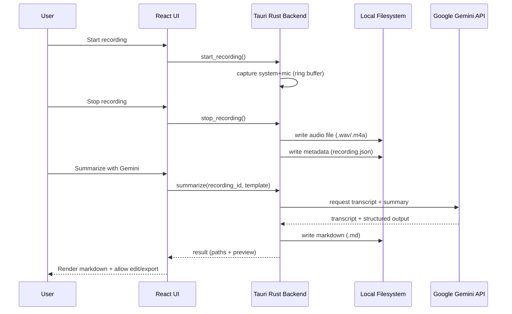

# SumMe — Project Documentation

## Purpose

SumMe is a lightweight, privacy-oriented, cross-platform desktop application that records **system audio + microphone** and produces **transcripts and structured summaries** using **Google Gemini**, exporting results into clean **Markdown** files.

## Goals

- Record system audio and microphone simultaneously with reliable A/V timing.
- Provide a minimal, fast UX: record → stop → summarize → preview/edit → export.
- Keep user data local by default (audio, metadata, generated markdown).
- Work in background: tray icon, global shortcuts, close-to-tray.
- Make summarization reproducible and configurable via prompt templates.
- Require a user-provided **Gemini API key** for summarization (no key → summarization disabled).

## Non-goals (MVP)

- Multi-user collaboration and shared workspaces.
- Cloud storage / syncing (optional post-1.0).
- Full semantic search across all notes (post-1.0).
- Calendar integrations (post-1.0).

## Target Tech Stack

- **Desktop framework**: Tauri 2.x
- **Frontend**: React 19 + TypeScript + Vite
- **UI**: shadcn/ui + Radix UI + Tailwind CSS
- **Markdown rendering**: `react-markdown` + `remark-gfm` + `rehype-highlight`
- **Audio capture (Rust)**:
  - Microphone: `cpal`
  - System output (native): `qruhear` (uses `screencapturekit` on macOS, `cpal` on Windows/Linux)
  - Buffering: `ringbuf`
  - WAV writing: `hound`
- **Gemini integration**: Rust (`reqwest`) or Node (`@google/generative-ai`) via IPC (decision recorded below)
- **Local storage**: filesystem + JSON metadata, optionally `tauri-plugin-store`
- **Hotkeys**: `tauri-plugin-global-shortcut`
- **Tray + notifications**: Tauri tray + notifications

## Repository layout (current)

Implementation lives under `apps/desktop`:

```text
.
├─ apps/
│  └─ desktop/                 # Tauri app (Rust + React)
│     ├─ src/                  # React UI
│     └─ src-tauri/            # Rust backend
├─ packages/
│  └─ prompts/                 # Prompt templates and versions
└─ docs/
   ├─ prd.md
   ├─ project.md
   └─ changelog.md
```

## Architecture overview

SumMe uses a **Tauri** application shell:

- **Frontend (React)**: UI, player, list of recordings, markdown preview/editor, settings.
- **Backend (Rust)**: audio capture, encoding, filesystem operations, OS integrations (tray, shortcuts), Gemini requests (option A) or secure IPC bridge (option B).

### High-level components

- **Recording Engine (Rust)**: captures system output + microphone, mixes or stores separate streams, writes audio to disk.
- **Processing Pipeline**:
  - optional: audio normalization/splitting
  - upload audio or transcript to Gemini
  - post-process results into Markdown format
- **Metadata Store**: persistent index of recordings (JSON) + settings (store plugin or JSON).
- **UI Layer**: recording controls, status/progress, playback, preview, editing, export.
- **OS Integrations**: tray status, global shortcuts, notifications, auto-start (post-MVP).

### Data flow (record → summarize)



## Key decisions (initial)

### Gemini integration approach

Two viable options:

- **Option A (preferred for simplicity)**: Rust backend calls Gemini over HTTPS using `reqwest`.
  - Pros: single runtime, fewer moving parts, easier to secure.
  - Cons: need to manage auth and request formatting in Rust.

- **Option B**: Node client (`@google/generative-ai`) running in frontend tooling, invoked via Tauri IPC.
  - Pros: official JS client, easier SDK usage.
  - Cons: additional surface area, careful handling of API keys required.

**MVP default**: start with Option A unless SDK limitations appear.

### Storage format

- Audio stored as files in a user-selected base directory.
- Each recording has:
  - audio file
  - metadata JSON
  - generated Markdown summary

This keeps data portable and Obsidian-friendly.

## Data model (planned)

### Recording metadata (example)

```json
{
  "id": "2026-01-14T12-30-00Z_abc123",
  "createdAt": "2026-01-14T12:30:00Z",
  "title": "Weekly Sync",
  "language": "auto",
  "audio": {
    "path": "recordings/2026-01-14_weekly-sync/audio.wav",
    "durationMs": 3600000,
    "format": "wav",
    "sampleRate": 48000,
    "channels": 2
  },
  "processing": {
    "status": "idle",
    "lastRunAt": null,
    "template": "meeting_notes"
  },
  "outputs": {
    "markdownPath": "recordings/2026-01-14_weekly-sync/notes.md"
  }
}
```

### Settings (planned)

- Base storage directory
- Default language (auto/manual)
- Recording quality preset (low/medium/high)
- Gemini:
  - API key (required for summarization; stored securely; implementation-dependent)
  - model name
  - prompt template selection
- Global shortcuts mapping

## UI (MVP screens)

- **Home**:
  - start/pause/resume/stop buttons
  - recordings list
  - selected recording: player + summarize button
- **Recording state**:
  - timer
  - tray indicator: idle/recording/processing
- **Preview**:
  - markdown preview + basic editing
  - export/copy
- **Settings**:
  - storage folder
  - Gemini API key and templates
  - hotkeys

## Prompt templates

Templates are versioned assets with stable identifiers, e.g.:

- `meeting_notes`
- `lecture_notes`
- `brainstorming`
- `interview`

Each template should define:

- goal and tone
- required sections (summary, key points, action items)
- timestamp and speaker label handling instructions

## Error handling & UX rules

- Recording:
  - fail fast with actionable error messages (permissions, device not found)
  - never block UI thread
- Summarization:
  - show progress states (upload → processing → done)
  - cache last successful markdown output per recording
  - allow re-run with a different template

## Security & privacy

- Data is stored locally by default.
- Summarization requires a user-provided Gemini API key.
- API keys must never be logged.
- **MVP implementation**: API keys are stored in `settings.json` as plain text for simplicity and reliability.
  - Future: Consider encryption or OS keychain for production release.
- Telemetry is off by default (MVP: none).
- Clearly communicate that summarization sends data to Gemini.

## OS-specific considerations

- **macOS**: system audio capture may require "Screen Recording" permission.
- **Windows**: loopback capture generally available; edge cases may need virtual audio devices.
- **Linux**: PulseAudio vs PipeWire differences; test on major distros.

## Risks & mitigations

- **System audio access complexity**: implement per-OS capture strategy; document required permissions.
- **Gemini cost**: show token/usage estimates and provide limits.
- **Transcript quality**: offer multiple templates and re-generation.
- **Bundle size**: keep dependencies minimal; leverage Tauri.

## Roadmap (high level)

- **MVP**: recording + summarize + markdown output + tray/hotkeys
- **1.0**: quality presets, language selection, templates UI, export integrations, theming, notifications
- **Post-1.0**: search, tags/projects, cloud mode, team features, calendar integrations, mobile

## Technical improvements (2026-01-14)

### Audio quality standardization
- **Problem**: Audio recordings had artifacts (slow playback, distortion) due to sample rate mismatch between system audio (via `qruhear`) and microphone (via `cpal`).
- **Solution**: Standardized both sources to 48kHz fixed sample rate. This ensures consistent timing and clean mixing when writing stereo WAV files.
- **Implementation**: Removed dynamic sample rate detection; both capture threads now use `SAMPLE_RATE = 48_000`.

### Audio playback in UI
- **Problem**: Recorded audio files were not playing back in the browser-based audio player component.
- **Solution**: Enabled Tauri's `protocol-asset` feature and configured `assetProtocol` security in `tauri.conf.json` to allow the frontend to access audio files via `convertFileSrc()`.
- **Implementation**: Added `protocol-asset` to `tauri` dependency features and configured asset protocol scope to allow all paths (`["**"]`).

### API key storage migration
- **Problem**: OS keychain integration (`keyring` crate) was unreliable during development, preventing API key storage and retrieval.
- **Solution**: Migrated to local storage in `settings.json` for MVP. API key is now stored as plain text alongside other app settings.
- **Implementation**: 
  - Removed `keyring` dependency and `secrets.rs` module
  - Added `gemini_api_key: Option<String>` to `Settings` struct in `storage/mod.rs`
  - Created helper functions: `get_gemini_api_key()`, `set_gemini_api_key()`, `has_gemini_api_key()`, `clear_gemini_api_key()`
  - Updated UI to display and edit the key directly (visible in text input)
- **Note**: For production, consider encrypting the key or using OS-specific secure storage.

### File operations improvement
- **Problem**: Tauri security model prevented direct file opening via `tauri-plugin-opener` due to path restrictions.
- **Solution**: Implemented native "Show in Finder/Explorer" functionality using OS-specific commands.
- **Implementation**:
  - Created `show_in_folder()` command that uses platform-specific commands:
    - macOS: `open -R <path>` (reveals file in Finder)
    - Windows: `explorer /select,<path>` (shows file in Explorer)
    - Linux: `xdg-open <parent_dir>` (opens parent folder)
  - Removed `tauri-plugin-opener` and `tauri-plugin-shell` dependencies
  - Updated UI button from "Open file" to "Show in Finder" for clarity

